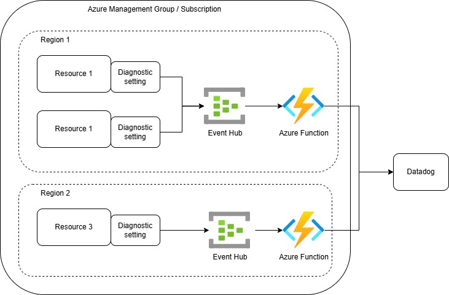

# Terraform Azure Datadog Log Forwarder :scroll:

Terraform code to setup Azure resources required to collect and forward Azure resource logs to Datadog instance.

**This repository builds on top of the logic from Datadog Repository - https://github.com/DataDog/datadog-serverless-functions/tree/master/azure and the business logic for the Azure Function is taken from [here](https://github.com/DataDog/datadog-serverless-functions/blob/master/azure/activity_logs_monitoring/index.js).**

## Reference Architecture :bulb:

Most Datadog sites (excluding US3) require a dedicated [Azure integration setup](https://docs.datadoghq.com/logs/guide/azure-logging-guide/?tab=automatedinstallation) to collect and forward Azure resource logs to Datadog. Below is an illustration of this setup:



### Key Components :pushpin:

The configuration involves the following steps:

#### 1. Event Hub Setup

Create an Azure Event Hub namespace and an Event Hub topic to collect resource logs.

#### 2. Datadog Integration

Deploy a Datadog Azure Function with an Event Hub trigger. This function ensures logs are pushed to Datadog in real time when they are generated.

#### 3. Diagnostic Settings

Configure Azure Resources and/or Azure Monitor to send resource and activity logs respectively to the Event Hub topic via Diagnostic Settings.

### Terraform Implementation :computer:

This repository provides the Terraform code to automate the creation and configuration of these resources, complete with virtual network integration for enhanced security.

> Note: Alternatively, to configure these resources manually or to automate the setup using Powershell scripts, follow the official Datadog documentation [here](https://docs.datadoghq.com/logs/guide/azure-logging-guide/?tab=automatedinstallation).

## Getting Started :rocket:

### Prerequisites :page_with_curl:

- Hashicorp Terraform - [Download](https://developer.hashicorp.com/terraform/install)
- Azure CLI - [Download](https://learn.microsoft.com/en-us/cli/azure/install-azure-cli-windows)
- Ensure you have access to an active Azure subscription. If you don’t have one, you can sign up for a [free Azure account](https://azure.microsoft.com/en-gb/pricing/purchase-options/azure-account/search?icid=free-search)
- Retrieve your Datadog API key from the Datadog dashboard under API Keys.

### Setup :hammer_and_wrench:

Follow these steps to set up and deploy the infrastructure:

#### 1. Clone the repository

```
git clone https://github.com/Azure-Samples/terraform-azure-datadog-log-forwarder.git  
cd terraform-azure-datadog-log-forwarder  
```

#### 2. Configure Azure Credentials

Login to Azure and set the default Subscription

```
az login  
az account set --subscription "<Your Subscription ID>"  
```

#### 3. Initialize Terraform

Initialize the Terraform project to download providers and prepare the workspace:

```
terraform init  
```

#### 4. Plan and Apply

Review the resources to be created and deploy them:

```
terraform plan -var="subscription_id=<Azure Subscription>" \
               -var="datadog_api_key=<Your Datadog API Key>"  
terraform apply -var="subscription_id=<Azure Subscription>" \
                -var="datadog_api_key=<Your Datadog API Key>"  
```

Replace the placeholders (`<Azure Subscription>` and `<Your Datadog API Key>`) with your specific values.

#### 5. Verify the Setup

Once the deployment is complete:

- Confirm that the Event Hub namespace, Datadog Azure Function, and other resources have been created in your Azure portal.
- Verify logs are being forwarded to your Datadog site as expected.

## To do

The following tasks will be added to the code base soon:

1. Example Azure resource with Diagnostic Setting configuration to direct logs to Event Hub